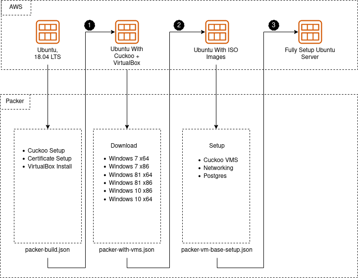
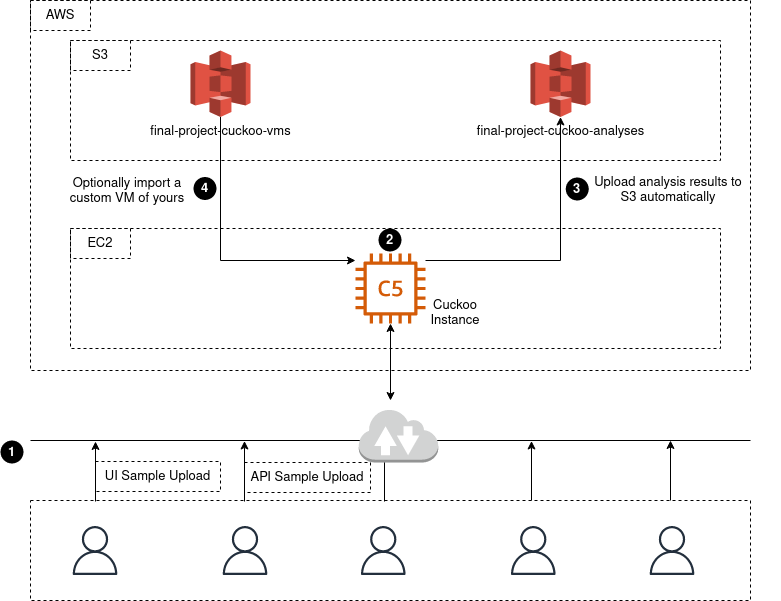

# Cuckoo AWS Infrastructure

A PoC for creating infra for running Cuckoo samples

## Packer

<br />




<br />
<br />

### Cuckoo Installation

<br />

Here we go off a clean Ubuntu 18.0 image and install Cuckoo and multiple other optional and required requirements based on some of the tools installed. This is the foundational image on top of which the rest will be built.

```
packer build packer-build.json
```

<br />

### Analysis Image (ISO) Downloads

<br />

6 ISO images are downloaded and frozen into another AMI image. The ISO’s are Windows 7, 8, and 10 in 32 and 64-bit architectures.

```
packer build packer-with-vms.json
```
<br />

### VirtualBox Setup

<br />

In this step, we do the final setup by configuring the virtualbox Virtual Machines. This uses VMCloak among other tools to set up the networking, creating the VMs correctly configured to be used by Cuckoo sandbox. This is the final image created and this is what will be used by the AWS infrastructure to execute the samples.

```
packer build packer-vm-base-setup.json
```

<br />
<br />
<br />

## Terraform

<br />

A high-level visualization of what the infrastructure in the terraform/ directory creates when applied to an AWS account.

<br />

